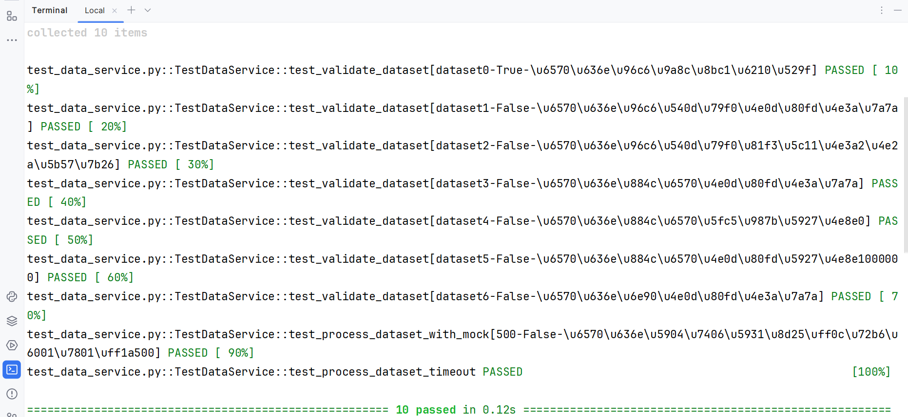

# 数据服务测试演示项目

## 项目简介

本项目展示了如何为python业务代码构建完整的测试，测试使用pytest框架实现

## 主要技术

-**pytest框架**：编写并运行测试

-**Fixture**:`pytest.fixture`提供可以重用的测试资源，保证测试的独立性

-**参数化测试**：`@pytest.mark.parametrize`覆盖多种测试场景

-**Mock技术**：`unittest.mock`隔离外部依赖，保证稳定性和速度

## 项目结构

-`data_service.py`:业务逻辑，包括对数据有效性的验证和数据处理

-`test_data_service.py`:对业务逻辑的测试

-`requirements.txt`:列出了项目运行所需要的所有第三方库

-`README.md`:项目说明文档

## 业务逻辑

**1.数据有效性的验证(`validate_dataset`)：**

-数据集名称：不能为空且至少2个字符

-数据行数：不能为空且是整数，范围是大于0，小于1000000

-数据源：不能为空

**2.数据处理(`process_dataset`)：**

-验证数据的有效性

-把有效的数据发送到服务器

-处理响应结果和异常情况

## 测试体系

**1.Fixture**

-使用Fixture，一个是`data_service`，一个是`validate_dataset`

-`data_service`提供测试对象实例

-`validate_data`提供正确有效的测试数据

-如果没有Fixture，就需要在每个测试中写创建测试对象实例和定义有效测试数据的代码，这样代码重复还容易出错

-而Pytest运行测试时，每个测试都会获得新的Fixture实例，这样测试独立，互不干扰

**2.参数化测试**

-数据验证测试：使用参数化测试一次性验证`validate_dataset()`的所有验证规则，覆盖了所有可能的场景，共7个测试用例，如果不使用参数化测试，那么就需要编写7个单独的测试函数。而这样提高了测试覆盖率，也避免了代码重复

-API响应测试：使用参数化测试验证外部API的响应处理，包括2种API响应状态码，也就是2个测试用例

**3.Mock**

-用Mock来隔离`requests.post`这个网络请求，

-在测试中模拟网络请求，网络超时

-同时验证业务代码用正确的参数调用外部API

## 测试结果

